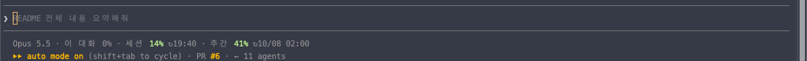

# secretj-claude-config

개인용 Claude Code dotfiles. **이 저장소 하나만 받으면 다른 컴퓨터에서 같은 환경으로 이어서 작업**할 수 있다.

```bash
git clone https://github.com/secretj/secretj-claude-config.git ~/Desktop/source/secretj-claude-config
cd ~/Desktop/source/secretj-claude-config && ./install.sh
```

무엇이 바뀌는지 먼저 보려면 `./install.sh --dry`.

마지막 최신화: **2026-10-06** — 사내 설정과 겹치는 부분을 덜어내고 개인 자산만 남겼다. 바뀐 내역은 [최신화 기록](#최신화-기록-2026-10-06) 에 있다.

---

## 구조 한눈에

<p align="center">
  
</p>

<p align="center">
  
</p>

> 두 도식은 CSS 애니메이션이 들어간 SVG 다. GitHub·브라우저에서 움직이고, 다크모드를 따라가고,
> `prefers-reduced-motion` 을 켠 환경에서는 정지 상태로 보인다. 자세한 내용은 아래 각 절에 있다.

---

## 이 저장소가 담는 것과 담지 않는 것

이 저장소는 **개인 자산만** 담는다. 네 갈래다.

| 갈래 | 어디에 |
|---|---|
| 역할별 서브에이전트와 그 오케스트레이션 | `agents/`, `skills/build-service/` |
| 신규 서비스 구축 워크플로 | `skills/build-service/` |
| 문서 작성 규칙 | `rules/korean-tech-writing.md`, `skills/html-doc/` |
| 블로그·카페 글쓰기 규칙 | `skills/blog-post/` |

여기에 **범용 개발 워크플로는 넣지 않는다.** 사내 설정 저장소가 정본으로 들고 있다. 아래 "사내 설정과의 경계" 를 본다.

---

## 설계 원칙

규칙을 어디에 두느냐가 효과를 결정한다. **로드 시점**으로 레이어를 나눈다.

| 레이어 | 언제 로드되나 | 여기 두는 것 | 이 저장소의 위치 |
|---|---|---|---|
| `CLAUDE.md` | 매 세션 전부 | **항상 참인 것**만. 권고 상한 200줄 | `CLAUDE.md` (40줄) |
| agent `description` | 매 세션 전부 | agent 를 **고를 수 있을 만큼만** | `agents/*.md` frontmatter |
| `rules/` | 매 세션, 또는 `paths` 매칭 파일을 열 때 | 주제별로 분리한 규칙 본문 | `rules/*.md` → `~/.claude/rules/` |
| `skills/` | 이름을 부를 때(`/name`), 또는 설명이 작업과 맞을 때 | 참조 자료와 반복 워크플로 | `skills/*/SKILL.md` |
| agent 본문 | 그 서브에이전트가 돌 때만 | 방법론·체크리스트·산출물 포맷 | `agents/*.md` 본문 |
| `hooks/` | 라이프사이클 이벤트마다 | **반드시 매번 일어나야 하는 것** | `hooks/*.sh` |
| `memory/` | 매 세션 (인덱스 + 본문) | 되돌아간 적 있는 판단·제약 | `memory/*.md` (복사 설치) |
| MCP | 세션 시작 (도구 이름만) | 외부 시스템 연결 | `mcp/mcp-servers.example.json` |

네 가지만 기억하면 배치가 결정된다.

- **매번 보장돼야 하면 훅이다.** CLAUDE.md 에 "커밋하지 마라"고 쓰는 것은 권고다. `PreToolUse` 훅은 결정적이다.
- **가끔 필요한 지식이면 스킬이다.** CLAUDE.md 에 넣으면 매 세션 토큰을 먹고, 길어지면 **다른 규칙이 묻힌다.**
- **조사가 대화를 채울 것 같으면 서브에이전트다.** 결론만 돌려받는다.
- **매 세션 로드되는 것은 CLAUDE.md 만이 아니다.** agent `description` 도 전부 로드된다. 상한을 CLAUDE.md 에만 적용하면 한쪽을 졸라매고 다른 쪽을 푸는 셈이다.

### 왜 commands/ 를 쓰지 않나

공식 문서가 `.claude/commands/` 를 **legacy** 로 명시한다. `skills/<name>/SKILL.md` 는 같은 `/name` 인터페이스를 주면서 다음을 더 준다.

- 보조 파일 동반 (`references/` 등)
- `paths` 로 조건부 활성화
- 세션 중 hot-reload
- `disable-model-invocation` / `user-invocable` 로 호출 주체 제어
- `context: fork` 로 서브에이전트 격리 실행

단 **사내 설정 저장소는 아직 `commands/` 를 쓴다.** 그쪽을 이 저장소가 고치지 않는다.

---

## 사내 설정과의 경계

같은 머신에 사내 설정 저장소가 따로 있다. 둘이 `~/.claude` 의 같은 자리를 노린다.
**디렉토리 단위로 소유권을 나눈다.** 겹치는 사본을 양쪽에 두지 않는다.

| `~/.claude` 의 위치 | 정본 | 담기는 것 |
|---|---|---|
| `commands/` | **사내 저장소** | 범용 개발 워크플로 9개 + 사내 전용 9개 |
| `agents/` | **이 저장소** | 역할 10개 + 탐색 6개. 사내 것은 접두사를 붙인 사본으로 공존 |
| `skills/` | **이 저장소** | 개인 스킬 6개 |
| `rules/`, `hooks/`, `templates/`, `CLAUDE.md` | **이 저장소** | — |

### 어느 installer 를 돌리면 무슨 일이 생기나

둘이 겹치는 자리는 **`agents/` 와 `settings.json` 둘뿐**이다. `commands/` 는 이 저장소가 아예 건드리지 않는다.

| | 이 저장소 `./install.sh` | 사내 installer |
|---|---|---|
| `commands/` | 손대지 않는다 | dir-symlink 로 점유 |
| `agents/` | **파일 단위** symlink. 남의 실제 파일은 보존 | **dir-symlink 로 덮어씀** → 이 저장소 agent 16개가 가려진다 |
| `settings.json` | 키 단위 머지. 외부 훅 보존 | **symlink 로 교체** → 머지 결과와 로컬 훅이 날아간다 |
| `skills/` `hooks/` `templates/` `rules/` `CLAUDE.md` `memory/` | 설치 | 손대지 않는다 |

**방향이 비대칭이다.** 이 저장소의 설치는 사내 설정을 깨지 않는다. 반대는 깬다.
사내 installer 를 돌린 뒤에는 `~/.claude/agents` 가 dir-symlink 로 바뀌었는지 확인하고, 그랬다면 그 심링크를 지우고 `./install.sh` 를 다시 돌린다. 절차는 설치 중 경고가 출력한다.

### 왜 agents 는 이 저장소가 정본인가

사내 설치 스크립트는 `agents/` 를 **디렉토리 단위 symlink** 로 덮어쓴다. 그 방식은 이 저장소의 역할 agent 10개를 전부 가린다.
이 저장소는 **파일 단위 symlink** 라 남의 파일과 한 디렉토리에서 공존한다. 그래서 `agents/` 는 이쪽이 정본이어야 둘 다 살아 있다.

### 왜 탐색 agent 6개는 중복인데 남겼나

`codebase-locator` · `codebase-analyzer` · `codebase-pattern-finder` · `docs-locator` · `docs-analyzer` · `web-search-researcher` 는 사내 사본과 **바이트 동일**하다.
그런데 사내 쪽은 접두사 없는 이름으로 설치되지 않는다. 이 저장소가 유일한 설치 경로다.
지우면 사내 `/research` 가 `codebase-locator` 를 못 찾아 깨진다. 그래서 **남긴다.**

동일성은 이렇게 확인한다.

```bash
for n in codebase-analyzer codebase-locator codebase-pattern-finder docs-analyzer docs-locator web-search-researcher; do
  diff -q <사내저장소>/agents/claude-code/$n.md agents/$n.md
done
```

---

## 무엇이 들어 있나

| 경로 | 설치 위치 | 방식 |
|---|---|---|
| `CLAUDE.md` | `~/.claude/CLAUDE.md` | symlink |
| `rules/` (1) | `~/.claude/rules/*.md` | 파일 단위 symlink |
| `skills/` (6) | `~/.claude/skills` | 디렉토리 symlink |
| `agents/` (16) | `~/.claude/agents/*.md` | 파일 단위 symlink |
| `hooks/` | `~/.claude/hooks` | 디렉토리 symlink |
| `templates/` | `~/.claude/templates` | 디렉토리 symlink |
| `settings.json` | `~/.claude/settings.json` | **머지 복사** |
| `memory/` (19) | `~/.claude/projects/<home>/memory/` | **복사** |
| `mcp/mcp-servers.example.json` | `~/.claude.json` 의 `mcpServers` | `--mcp` 옵션 |

symlink 로 걸린 것들은 로컬에서 고치면 저장소에 바로 반영된다 — `git diff` 로 확인하고 커밋하면 다른 머신으로 넘어간다.

**settings.json 이 symlink 가 아닌 이유**: Claude Code 가 이 파일에 자기 생성 블록(`autoMode.environment` 등 머신·조직 환경 정보)을 직접 써 넣는다. symlink 였다면 그게 공개 저장소로 흘러든다. 그래서 **저장소가 관리하는 키만 덮어쓰고 나머지 로컬 키는 보존**하는 머지 복사를 쓴다.

**memory 가 복사인 이유**: Claude 가 대화 중 새 memory 를 그 디렉토리에 계속 쓴다. symlink 였다면 앞으로 쌓이는 개인 메모가 전부 이 공개 저장소로 흘러든다. 그래서 설치는 단방향 복사(기존 파일 보존)이고, 공유하고 싶은 memory 만 손으로 `memory/` 에 넣어 커밋한다.

---

## CLAUDE.md 와 rules

`CLAUDE.md` 는 40줄이다. 응답·검증·탐색·문서·세션 다섯 갈래의 **항상 참인 규칙**만 두고, 상세는 아래로 내려보낸다.

| 규칙 | 어디로 |
|---|---|
| 한국어 기술문서 통제 언어 8규칙 | `rules/korean-tech-writing.md` |
| HTML 문서 포맷(Apple 톤 기술 메모) | `skills/html-doc/` |
| 블로그·카페 작성 법칙 | `skills/blog-post/` |
| 검증 절차 | `skills/verify/` |

`CLAUDE.md` 끝에 `@~/.claude/CLAUDE.private.md` 를 import 한다. 소속·이름처럼 공개하면 안 되는 규칙은 거기 둔다 — `.gitignore` 로 차단돼 있고 `install.sh` 가 없으면 빈 파일로 만든다.

---

## skills (6)

| 스킬 | 용도 | 자동 호출 |
|---|---|---|
| `/verify` | 테스트·린트·타입체크·빌드를 찾아 실행하고 출력을 근거로 남기는 검증 게이트 | 허용 |
| `/html-doc` | "HTML 로 문서 만들어줘" 의 기본 포맷 — Apple 톤 기술 메모, 좌측 목차 2단, scroll-spy | 허용 |
| `/blog-post` | 네이버 블로그·카페 원고 법칙 — 채널 분기, 제목 공식, 문체, 해시태그, 캡처, 발행 게이트 | 허용 |
| `/build-service` | 7개 subagent 를 PM 오케스트레이션으로 묶어 신규 서비스를 0에서 구축하는 8 Phase 워크플로 | **차단** |
| `/distill` | 세션에서 발견한 비자명한 도메인 지식을 Obsidian 에 구조화해 축적 | **차단** |
| `/sync-knowledge` | Obsidian 지식을 저장소 `CLAUDE.md` 의 "도메인 지식" 섹션으로 내보내 팀 공유 | **차단** |

`verify` 는 **이름을 규약으로 쓴다.** 커밋 전 검증을 한 군데로 모으려는 의도다.
Claude Code 가 이 이름을 보고 커밋 전에 자동 실행하는지는 이 저장소 안에 근거가 없다 — `CLAUDE.md` 규칙 4가 명시적으로 호출하게 해 두었다.

### 자동 호출을 차단한 기준

`disable-model-invocation: true` 를 붙인 셋은 **되돌리기 비싼 쓰기 side-effect** 가 있다.

- `build-service` — subagent 7개를 8 Phase 로 띄운다. 비용이 크다.
- `distill` — Obsidian vault 에 파일을 쓴다.
- `sync-knowledge` — 대상 저장소의 `CLAUDE.md` 를 고쳐 쓴다. git 에 올라가는 파일이다.

"알아서 띄우지 마라"를 본문에 적어두는 것은 권고다. frontmatter 는 결정적이다. 설명이 Claude 컨텍스트에 올라가지 않아 토큰도 아낀다.

### blog-post 의 구성

```
skills/blog-post/
├── SKILL.md                 # ⓪ 채널 판별 → 절대 규칙 10개 → 채널별 작업 순서
└── references/
    ├── 01-title.md          # 제목 공식 — 주력 키워드 맨 앞, 30~40자
    ├── 02-body.md       ★   # 블로그 문체 — 어미와 줄바꿈이 8할
    ├── 03-hashtags.md       # 주력 3 : 확장 12 : 롱테일 15
    ├── 04-capture.md        # 사진 개수·캡션·출처·리사이즈
    └── 05-cafe.md       ★   # 카페 규칙 — 블로그와의 차이표가 여기 있다
```

**두 채널은 어미가 반대다.** 블로그는 `~에요`/`~어요` 를 쓰고 `~습니다` 를 금지한다. 카페는 `~습니다` 가 주 어미다.
소제목·형광펜·해시태그 개수·분량·발행 절차도 다르다. 그래서 `SKILL.md` 가 **채널 판별을 ⓪단계로** 둔다.

작업장 자체는 `~/Desktop/blog/` 다. 세션 기록(`05-작업-컨텍스트.md`)과 자동화 툴체인(`automation/`)은 분량이 커서 이 저장소에 넣지 않고 로컬에서 읽는다.
카페 규칙의 정본은 그 세션 기록의 §27 이고, `references/05-cafe.md` 가 그것을 추린 것이다.

---

## agents (16)

### 역할 (10) — 한국어 업무톤

이름으로 직접 호출하거나 `description` 의 키워드로 자동 선택된다.

| 이름 | 역할 | 호출 트리거 |
|---|---|---|
| `planner` | 기획자 | 요구사항 정리, PRD, MVP, 유저 플로우 |
| `architect` | 아키텍트 | 구조 설계, DDD, ADR, API 설계, 마이그레이션 계획 |
| `developer` | 개발자 | 구현, 리팩토링, 버그 수정, 성능 개선 |
| `designer` | 디자이너 | UX, 레이아웃, 컬러/타이포, 접근성 |
| `qa` | QA | 테스트 케이스, 회귀, 스모크, 릴리스 게이트 |
| `security` | 보안 | OWASP, 취약점, XSS, 위협 모델 |
| `infra` | 인프라 | 배포, CI/CD, 모니터링, 비용 |
| `pm` | PM | 일정, 진척, 리스크, 회고, 오케스트레이션 |
| `lead` | 팀장 | 결정, 방향, 리뷰 종합, 승인 |
| `marketer` | 마케터 | 마케팅, 카피, 타겟, 캠페인 |

`pm` 은 `Agent` 도구로 다른 agent 를 직접 spawn 하는 오케스트레이터 모드를 갖는다.

### 탐색 (6)

워크플로가 내부적으로 호출한다. 직접 부를 일은 드물다.
`codebase-locator` · `codebase-analyzer` · `codebase-pattern-finder` · `docs-locator` · `docs-analyzer` · `web-search-researcher`

### description 은 agent 를 고를 수 있을 만큼만 쓴다

`description` 은 **매 세션 메인 컨텍스트에 전부 로드된다.** Claude 가 agent 를 고르는 근거라서 그렇다.
그래서 여기 두는 것은 **역할 한 줄 + 핵심 담당 + 호출 키워드 + 혼동되는 경계** 뿐이다.

방법론·체크리스트·산출물 포맷·장기 기억 경로·MCP 도구 목록은 **본문**에 둔다. 본문은 그 서브에이전트가 돌 때만 로드된다.

현재 16개 합계 3,547자다. 한 개가 300자를 넘으면 본문으로 내려보낼 것이 있는지 본다.

확인 방법:

```bash
python3 - <<'PY'
import glob, io, yaml
tot = 0
for p in sorted(glob.glob('agents/*.md')):
    d = yaml.safe_load(io.open(p, encoding='utf-8').read().split('---')[1])
    tot += len(d['description'])
    print('%5d  %s' % (len(d['description']), d['name']))
print('합계 %d자' % tot)
PY
```

---

## hooks

`gate-git-write.sh` — **PreToolUse 훅.** 지정한 디렉토리 안에서 `git commit` / `push` / `merge` / `reset --hard` 를 사람 승인(`ask`)으로 되돌린다.

차단이 아니라 확인이다. 사용자가 요청한 커밋은 그대로 통과하고, 에이전트의 임의 실행만 멈춘다.

훅이어야 하는 이유: 전역 `settings.local.json` 의 allow 목록에 `Bash(git commit:*)` 가 있으면 프로젝트 설정을 지워도 다시 허용된다. permissions 로는 못 막는다.

대상 디렉토리는 둘 중 하나로 준다. **비어 있으면 아무것도 막지 않는다.**

```bash
# 1) 설정 파일 — 한 줄에 한 경로. install.sh 가 빈 파일로 만들어 둔다
$EDITOR ~/.claude/git-gate-dirs

# 2) 환경변수 — 콜론 구분
export CLAUDE_GIT_GATE_DIRS="$HOME/work/repo-a:$HOME/work/repo-b"
```

경로 자체가 조직 정보일 수 있어 설정 파일은 추적하지 않는다.

`statusline.sh` — **statusLine 스크립트.** 훅은 아니지만 같은 디렉토리 symlink 로 설치된다. 플랜 사용 한도와 이 대화가 쓴 몫을 상태줄에 한 줄로 보여 준다.

<p align="center">
  
</p>


| 칸 | 뜻 | 출처 |
|---|---|---|
| `세션` | 5시간 한도 사용률. `/usage` 의 "Current session" 과 같다 | `rate_limits.five_hour` |
| `주간` | 7일 한도 사용률 | `rate_limits.seven_day` |
| `이 대화` | 세션 사용량 중 이 대화의 비중. 세션 8% 중 2%p 를 이 대화가 썼으면 25% | 직접 센다 |

- `↻` 뒤는 리셋 시각이다. 사용률은 70% 부터 노랑, 90% 부터 빨강이다.
- `이 대화` 는 입력 JSON 에 없는 값이라 장부로 센다. 장부는 세션 창마다 파일 하나(`$TMPDIR/claude-statusline-<uid>/ledger-<resets_at>.json`)이고, 이 컴퓨터의 모든 대화가 공유한다.
  1. 대화마다 이번 창에서 쓴 비용(`cost.total_cost_usd` 의 증가분)을 장부에 쌓는다.
  2. 세션 사용률이 오르면, 오른 만큼을 그사이 각 대화가 쓴 비용 비율로 나눠 배정한다.
  3. 그사이 이 컴퓨터의 대화가 비용을 쓰지 않았으면, 다른 곳(claude.ai·다른 컴퓨터)의 몫으로 둔다.
- 그래서 이 컴퓨터의 대화를 모두 합쳐도 100% 를 넘지 않는다.

<p align="center">
  
</p>

- 새 창이 열리면 스크립트가 새 장부를 쓰고 지난 장부를 지운다. 크론은 쓰지 않는다.
- 한계 — 같은 순간에 다른 곳에서 쓴 양은 그 순간 비용을 쓴 대화에 섞인다. 비용과 한도 차감이 비례한다는 것은 가정이다. 장부가 생기기 전의 사용량은 누구 몫으로도 배정하지 않는다.
- API 키 사용자는 `rate_limits` 가 없어 한도 칸이 빠진다.
- `/usr/bin/python3` 가 필요하다. `install.sh` 와 같은 조건이다.

---

## memory

`memory/*.md` 19개는 **되돌아간 적 있는 판단**을 남긴 것이다. 코드를 읽으면 알 수 있는 것은 넣지 않는다.

`feedback_` 은 사용자 지시, `project_` 는 진행 중인 작업 맥락, `reference_` 는 외부 자원 위치다. `MEMORY.md` 가 인덱스이고 매 세션 로드된다.

설치는 **링크 대상 파일 기준**으로 중복을 판단해 병합한다 — 같은 memory 를 가리키는 줄이 이미 있으면 문구가 달라도 덧붙이지 않는다.

조직 식별 정보가 섞인 memory 는 **표현을 일반화해서** 넣는다. 예: 사내 서비스명 고정 TZ 얘기는 `feedback_multiregion_timezone` 으로 중립화했다.

---

## MCP 서버

`mcp/mcp-servers.example.json` 이 템플릿이다. **토큰은 절대 커밋하지 않는다.**

```bash
cp mcp/mcp-servers.example.json mcp/mcp-servers.json   # .gitignore 처리됨
$EDITOR mcp/mcp-servers.json                            # <...> 자리를 채운다
./install.sh --mcp
```

토큰이 필요 없는 것들은 그냥 이렇게 등록해도 된다.

```bash
claude mcp add-json --scope user codegraph  '{"type":"stdio","command":"codegraph","args":["serve","--mcp"]}'
claude mcp add-json --scope user playwright '{"type":"stdio","command":"npx","args":["-y","@playwright/mcp@latest"]}'
claude mcp add-json --scope user notion     '{"type":"http","url":"https://mcp.notion.com/mcp"}'
```

`obsidian` 은 Obsidian Local REST API 플러그인 키, `Neon` 은 Neon API 키가 필요하다.

**서버를 늘릴 때는 개수를 센다.** 커뮤니티 권고는 활성 서버 10개 미만이다.
MCP 도구 검색이 기본이라 쓰지 않는 도구는 컨텍스트를 거의 먹지 않지만, 서버가 늘면 세션 시작 비용이 올라간다.
연결 상태는 `/mcp`, 토큰 사용량은 `/context all` 로 본다.

---

## 설치 동작

| 상황 | 동작 |
|---|---|
| 대상이 없음 | symlink 생성 |
| 일반 파일/디렉토리 | `.bak.YYYYMMDD_HHMMSS` 로 백업 후 symlink |
| 이미 우리 저장소로 symlink | 건너뜀 (멱등) |
| 다른 곳으로 걸린 **디렉토리** symlink | **건드리지 않고, 되돌리는 절차를 출력** — 남의 자산일 수 있어 자동으로 걷어내지 않는다 |
| `settings.json` 이 symlink | 내용만 복사해 **실제 파일로 바꾼다** — 그러지 않으면 머지가 링크를 따라가 남의 저장소 파일을 덮어쓴다 |
| 다른 곳으로 걸린 `CLAUDE.md` | 경고 후 백업하고 **이 저장소로 회수** |
| 저장소에서 지운 agent·rule 의 symlink | **끊긴 링크로 판별해 정리** (`prune_dangling`) |

`agents/`, `rules/` 는 파일 단위라 다른 출처의 파일과 한 디렉토리에서 공존한다. 단 그 디렉토리 자체가 dir-symlink 이면 개별 파일을 넣을 수 없어 건너뛴다.

`prune_dangling` 은 **우리 저장소를 가리켰던 끊긴 symlink 만** 지운다. 남의 실제 파일과 남의 symlink 는 건드리지 않는다.

제거: `./uninstall.sh` — 우리가 만든 symlink 와 끊긴 잔해만 지운다. `.bak.*` 와 복사된 memory·settings 는 남는다.

---

## 유지보수

- **정기 점검**: `/doctor prompt-audit` 가 `CLAUDE.md`·rules·skills·agents 를 훑어 낡은 지시, 없는 파일 참조, 서로 모순되는 규칙을 찾아준다. 파일은 승인 전까지 바뀌지 않는다. (v2.1.283+)
- **이름 충돌 주의**: 개인 스킬은 번들 스킬보다 우선한다. 사내 `commands/` 와 이름이 겹치면 **스킬이 이긴다.**
- **버전**: `claude update`. auto-update 는 세션 중 바이너리 교체 문제로 꺼 두었다. 기능별 최소 버전이 있다 — auto mode 기본값 v2.1.283+, Claude Mods v2.1.287+.
- **CLAUDE.md 가 길어지면** 규칙이 묻힌다. 늘려야 할 상황이면 먼저 `rules/` 나 `skills/` 로 내려보낼 것이 없는지 본다.
- **agent 를 추가할 때는** `description` 을 300자 안에 쓰고 상세는 본문에 둔다. 도구는 읽기 전용(`Read, Grep, Glob`)으로 시작해 필요한 만큼만 넓힌다.

---

## 최신화 기록 (2026-10-06)

사내 설정과 겹치는 부분을 덜어내고, 매 세션 로드되는 분량을 줄였다.

### 삭제

| 대상 | 이유 |
|---|---|
| `hooks/log-session.sh` (Stop 훅) | 쓰지 않게 됐다. `settings.json` 의 `Stop` 훅 설정도 함께 뺐다 |
| 범용 워크플로 9개 (`research` `create-plan` `implement-plan` `validate-plan` `iterate-plan` `handoff` `resume-handoff` `debug` `commit-suggest`) | 사내 사본과 **완전히 바이트 동일**했다(`commands/*.md` 기준). 직전 커밋 이후 `skills/` 로 옮기던 중이어서 git 에는 `commands/*.md` 삭제로 찍힌다. `~/.claude/commands/` 가 9개 전부 제공하는 것을 확인하고 지웠다 |

### 추가

| 대상 | 내용 |
|---|---|
| `rules/` | 주제별로 분리한 규칙. `~/.claude/rules/` 에 파일 단위 설치 |
| `skills/verify/` | 검증 게이트. `CLAUDE.md` 규칙 4가 호출한다 |
| `skills/html-doc/` | HTML 기술 메모 포맷 |
| `skills/blog-post/` | 블로그·카페 작성 법칙 + `references/` 5개 |
| `hooks/gate-git-write.sh` (PreToolUse 훅) | git 쓰기 명령을 사람 승인으로 되돌린다. 지운 `log-session.sh` 를 대체한다 |
| `.gitignore`: `skills/synced/`·`CLAUDE.private.md`·`git-gate-dirs` | 남의 자산과 식별 정보를 추적에서 뺀다 |
| `skills/blog-post/references/05-cafe.md` | 네이버 카페 규칙. 로컬 작업장 세션 기록 §27 에서 추출했다 |
| `skills/blog-post/SKILL.md` 의 ⓪단계 | 채널 판별. 두 채널은 어미가 반대라 먼저 정해야 한다 |
| `install.sh` / `uninstall.sh` 의 `prune_dangling` | 저장소에서 지운 파일의 끊긴 symlink 정리. 기존 루프는 저장소에 **남은** 파일만 순회해서 잔해가 영구히 남았다 |
| `disable-model-invocation: true` | `build-service` · `distill` · `sync-knowledge`. 되돌리기 비싼 쓰기 side-effect 가 있다 |
| README 의 "사내 설정과의 경계" | 디렉토리 단위 소유권 표. 어느 쪽이 정본인지 명시한다 |

### 수정

| 대상 | 내용 |
|---|---|
| agent `description` 8개 | 5,354자 → 1,944자 (64% 감소). 방법론·Obsidian 경로·MCP 목록은 **이미 본문에 있던 중복**이라 지워도 정보를 잃지 않는다. 16개 합계 3,547자 |
| `settings.json` 설치 방식 | symlink → **머지 복사.** Claude Code 가 쓰는 `autoMode.environment` 가 공개 저장소로 새는 것을 막는다 |
| `settings.json` 훅 | `Stop`(log-session) → `PreToolUse`(gate-git-write). `switchModelsOnFlag: true` 를 켰다 |
| `CLAUDE.md` 규칙 11 | 카페를 포함하고, 채널을 먼저 정하라는 조건을 넣었다 |

### 적대적 리뷰로 잡은 것

작업을 끝낸 뒤 fresh context 서브에이전트에 diff 를 검토시켰다(`CLAUDE.md` 규칙 6). 거기서 나온 수정이다.

| 고친 것 | 무엇이 문제였나 |
|---|---|
| `install.sh` 의 `merge_settings` | `hooks` 키를 통째로 덮어써서 **다른 도구가 등록한 훅 9개 이벤트가 조용히 사라졌다.** "보존한 로컬 키" 에도 안 찍혔다. 이벤트 단위 병합으로 바꿨다 — 이 저장소가 설치한 훅(`~/.claude/hooks/` 를 가리키는 것)만 교체하고 남의 훅은 보존한다 |
| 조직 식별자 5곳 | `README.md`, `agents/infra.md`, `blog-post` 참조 3곳에 사내 브랜드·제품명·내부 호스트명이 있었다. 규칙은 보존하고 식별자만 치환했다 |
| `references/02-body.md` | 로컬 정본보다 25줄 뒤처져 있었다. 빠진 구간이 "사용자가 직접 고쳐 쓴 말투" 섹션이라 실제 행동 규칙이 손실돼 있었다. 동기화하고 `01`~`04` 에 **정본 선언**을 붙였다 |
| 카페 해시태그 개수 | "9~10개"로 썼는데 실측은 **7~10개**다(원고 5편). 7개짜리 2편을 규정 미달로 오판할 수 있었다 |
| 블로그 해시태그 개수 | 같은 개념이 "상한 30" · "20~30" · "26~30" 세 값으로 쓰여 있었다(`rules/korean-tech-writing.md` 규칙 6 위반). `20~30개(상한 30)` 로 고정했다. "26~30" 은 근거가 없었다 |
| `SKILL.md` 작업 순서 ③ | 로컬 정본의 「내 템플릿」 규칙과 서체·크기 구체값(바른히피·15)이 빠져 있었다 |
| `agents/pm.md` | 모델 호출을 막아 둔 `build-service` 를 "쓰라"고 지시하는 모순이 있었다. "사용자에게 `/build-service` 를 안내한다"로 바꾸고 `신규 서비스` 키워드를 description 에 복원했다 |
| README 사실 오류 | 사내 전용 커맨드 개수(8→9), 삭제 대상 서술, description 축약 수치(5,370→5,354), `verify` 자동 실행 단정 |

### 손대지 않은 것과 그 이유

- **탐색 agent 6개** — 사내 사본과 바이트 동일하지만 **이쪽이 유일한 설치 경로**다. 지우면 사내 `/research` 가 깨진다.
- **`lead` · `marketer` description** — 각 100자다. 이미 간결해 줄일 것이 없다.
- **`build-service` 의 8 Phase 구조** — 동작 중이라 건드리지 않았다.
- **`templates/`** — 여행 계획 템플릿 2개 유지.
- **agent 본문 분량** — `lead`·`marketer` 가 29·30줄인데 `developer` 는 445줄이다. 깊이가 고르지 않지만, 쓰지도 않을 분량을 채우는 것보다 그대로 두는 것이 낫다고 보았다.

### 반영한 흐름과 그 출처

한국 개발자·기업이 공개한 Claude Code 활용 사례를 조사해 교차 검증된 것만 들였다.

| 들인 것 | 이 저장소에서 | 출처 |
|---|---|---|
| CLAUDE.md 상한과 `rules/` 분리 | 이미 충족 (40줄) | 여러 출처에서 공통. 가장 널리 반복되는 권고 |
| 매 세션 로드되는 분량을 센다 | agent `description` 다이어트 | LY Corporation 발표의 "컨텍스트는 공유 자산" + CLAUDE.md 150줄 압축 |
| 스킬 호출 방식을 frontmatter 로 명시 제어 | `disable-model-invocation` 3개 | 복수 개인 기술블로그 |
| 훅은 지시문이 아니라 강제 장치다 | `gate-git-write.sh` | 복수 출처 공통 |
| 서브에이전트 도구는 읽기 전용부터 넓힌다 | 유지보수 항목에 기록 | 복수 개인 기술블로그 |

**출처에 대해 정직하게 적어둔다.**

- 요청했던 토스·카카오·네이버·쿠팡·당근마켓·우아한형제들·뱅크샐러드는 **Claude Code 방법론 공개 글을 찾지 못했다.** 검증 가능한 1차 기업 출처는 **LY Corporation(LINE) 한 곳**이다.
- 나머지는 개인 기술블로그이고, 그중 일부는 **Anthropic 공식 문서의 한국어 번역·요약**이다. 한국 독자 방법론이 아니다.
- "MCP 서버 10개 미만" 권고는 받아들였지만 **이 환경에는 문제가 없었다.** 실측 user-scope 서버가 7개다. 없는 문제를 만들지 않았다.

---

## 이 저장소에 넣지 않는 것

- **소속 조직의 자산** — 사내 저장소 구조, 내부 호스트명, Jira/Confluence pageId, 티켓 ID, 조직 전용 MCP 패키지, 게이트 대상 경로. `.gitignore` 로 `docs/`, `skills/wiki-report*/`, `private/` 를 차단해 둔다 (파일은 디스크에 남고 추적만 안 된다).
- **범용 개발 워크플로** — 사내 저장소의 `commands/` 가 정본이다.
- **토큰·키** — `*.local.json`, `mcp-servers.json`, `.env`, `*.token`, `*.pem`, `*.key`.
- **식별 정보** — 소속·이름은 `CLAUDE.private.md` 와 로컬 memory 에만 둔다.
- **새로 쌓이는 memory** — 위 "memory 가 복사인 이유" 참고.
- **자동 동기화되는 남의 자산** — `skills/synced/` (claude.ai 번들 스킬).

커밋 전 확인:

```bash
git diff --cached | grep -niE "token|secret|api[_-]?key|Bearer |password"
```
